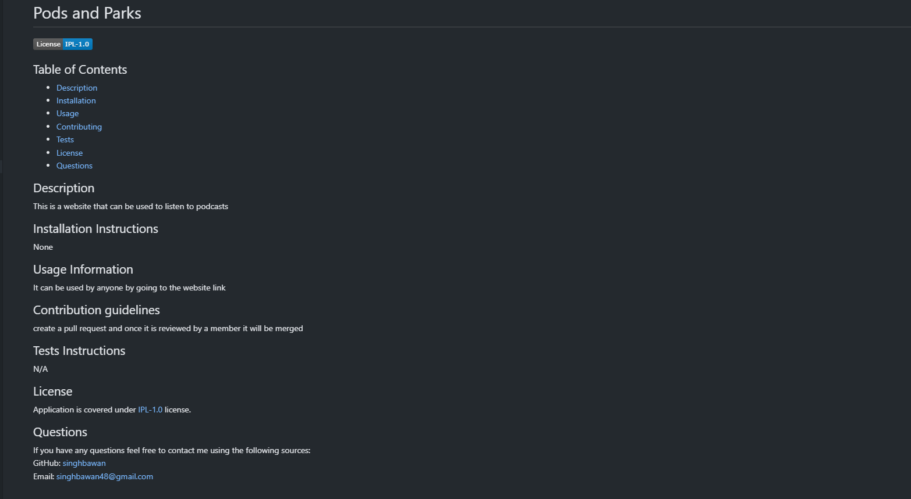

# Readme-Generator

## Purpose

### To generate a high quality readme file by using using data provided by user interface through command line.

### Following is a link to the video demonstrating the functionality of a Readme file generator: 

## [Demo Video Link](https://drive.google.com/file/d/1tI66zRUK4bOjhgeti5LHKVKFmmpncy84/view)

## Built using
* Javascript
* Node.js
* inquirer package

## Contribution

Made by Bawandeep Singh
